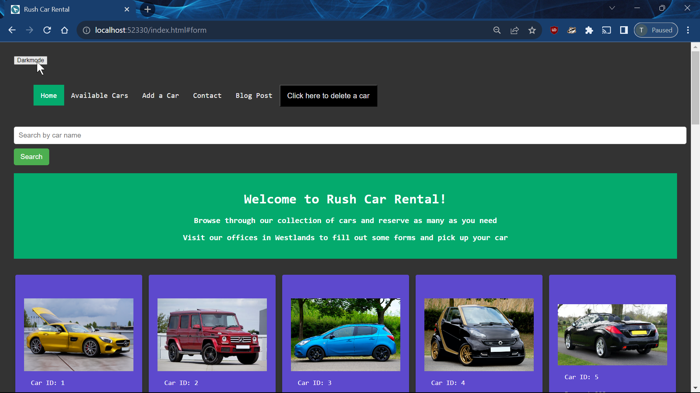

# Phase 1 Project: Rush Rental App

## Project Description

This is a website that allows users to view available cars on the website, reserve cars, add cars to the website and delete cars from the website.
All of these changes are permanent and are reflected on the db.json file. They persist even after reloading the page.

Here is the link to my project web page: [Rush Car Rental](https://tomutanyi.github.io/phase-1-project/)

Here is a [link](https://medium.com/@tomutanyi/my-moringa-school-phase-1-project-6a91ccd49a72) to my blog post on the project.

## Technologies used

HTML, CSS.
Javascript and Node.js.
The JSON file is hosted on Render.
The frontend is hosted on GitHub pages.

## Project features

### 1. Reserving a car

Clicking on the reserve button reduces the amount of cars available by one through a PATCH request to the JSON file.

### 2. Submitting a new car

Filling in the form at the bottom with the relevant details adds a new car to the website with an ID that is automatically generated.
This is accomplished by a POST request.

### 3. Deleting a car

Clicking on the delete button on the navbar prompts a user for an ID of a car to delete.
This is accomplished through a DELETE request.

### 4. Dark Mode

Clicking on the dark mode button turns the bacground color of the website dark. This feature could be useful for dark places.

## Project Setup

The project requires the installation of Node in order to work. You can find the instructions to install Node [here](https://nodejs.org/en)

The project requires the installation of a json server by entering the following command into your terminal:

`npm install -g json-server`

One then starts the server by entering this command:

`json-server --watch db.json`

The server should then be up and running. It is important to note that this is an essential step in the running of the project and without these commands, it will be impossible to fetch the data from the db.json file.

To stop running the server, one can simply open up a terminal and type in:

`CTRL + c`

The index.html file can then be run on any mordern browser.

## Author

Tom Omele Mutanyi

## License

Licensed under the [MIT license](LICENSE)
